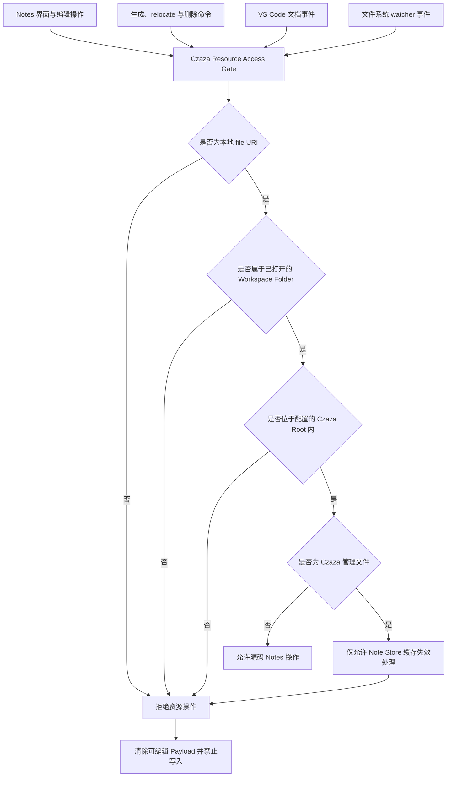

# Czaza 资源访问 Gate

本方案为 Notes 界面、命令、生成、relocate、删除和变化检测提供统一的资源边界，防止工作区外文件或 Czaza 管理文件进入笔记操作。

## 访问流程

## 关键规则

- 传入具体资源时必须使用该资源所属的 Workspace Folder，不得回退到第一个 Workspace Folder。
- 位于 Workspace Folder 内但处于配置的 Czaza Root 外部的资源必须被拒绝。
- `.czaza/notes`、`index.json` 及其他 Czaza 管理文件不得成为 File、Section 或 Line Note 的目标。
- Czaza 管理文件的外部变化只能触发 Note Store 缓存失效，不得进入源码检测或 relocation。
- Gate 拒绝当前资源时，Notes Panel 必须清除上一个文件的可编辑 Payload、高亮、选择和 relocate session。
- WebView 入口负责阻止无效操作，底层写服务在持久化前使用同一 Gate 再次验证。
- Navigator 中源文件已丢失的 orphaned Notes 通过可信项目根目录和安全相对路径管理，不要求源文件仍然存在。

## Gate 结果

- `allowed`：资源可以进入读取、编辑、生成、relocate、删除或变化检测流程。
- `unsupportedScheme`：资源不是本地 `file` URI。
- `outsideWorkspace`：资源不属于任何已打开的 Workspace Folder。
- `outsideRoot`：资源不在配置的 Czaza Root 内。
- `managedOutput`：资源属于 Czaza 自己管理的输出文件。

## 与当前实现的关系

当前根目录解析在资源不属于任何 Workspace Folder 时可能回退到第一个 Workspace Folder，Notes Panel 也可能在 `outsideRoot` 后保留上一个有效 Payload。本图描述统一替代这些分散判断的目标 Gate；该 Gate 尚未实现。
