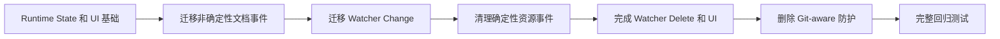

# Git 解耦迁移顺序

本方案记录 CZaza 将 Git-aware 变化防护替换为 Runtime State 和通用任务协调架构的已完成迁移。

## 迁移流程

## 实施状态

- 已完成：Runtime State Registry、只读检测、被动检查、Detail/Navigator 展示、Clear Stale、Relocate、确定性 Undo/Redo、非确定性文档事件、Watcher Change、带最终存在性检查的 Watcher Delete、missing UI 立即刷新，以及文件和目录的 VS Code Rename/Move/Delete/Remove。
- 已完成：Watcher 防抖、按资源队列、任务失效和 Delete suppression 由通用 `ChangeTaskCoordinator` 接管。
- 已删除：Git HEAD 监听、transition Guard、Git-aware Gate、revision 判断及其专用测试。

## 阶段说明

### 迁移规则

- 确定性 dirty 编辑继续立即更新 Notes，不等待保存，也不进入 Candidate Registry。
- 非确定性文档事件和 Watcher 只更新 Runtime State。
- VS Code 明确提供路径映射的 Rename/Move/Delete/Remove 属于确定性变化，可以立即更新 Notes。
- 每迁移一个入口，先验证 Note JSON 不会被自动事件修改，再处理下一个入口。
- Git checkout、merge 和 restore 与其他外部磁盘变化一样由 Watcher 和 Runtime State 处理。

### 删除 Git-aware 防护

- 从 `extension.ts` 删除 `GitWorkspaceTransitionGuard` 的创建和 Git 监听注册。
- 删除 `workspaceTransition` 目录中的 Git HEAD 监听、transition timer 和 revision token 实现。
- 删除事件注册函数中的 `workspaceTransitionGuard` 参数和分支。
- 删除只验证旧 Git-aware 行为的测试，并用 Runtime State 行为测试替代。
- 删除专门用于“等待 Git HEAD 稳定”的 800ms 延迟确认。

## Debounce 保留边界

- 删除的是依赖时间猜测 Git checkout 是否完成的延迟确认。
- Watcher 重复通知合并、UI refresh 合并和同资源任务串行化仍然有独立价值，可以保留。
- 保留的 debounce 只用于减少重复工作，不得决定是否具有 Note Store 写入权限。
- 确定性写入资格来自 dirty、可确定计算、资源 Gate 和最终有效性检查，而不是“等待足够久”。

## 每阶段完成条件

- 新增路径具有纯逻辑单元测试和对应事件集成测试。
- 非确定性自动检测不会修改 Note JSON 或 `index.json`；确定性 dirty 编辑和用户确认可以修改。
- 快速来回切换分支、`git restore`、外部文件替换和普通手动编辑具有不同但确定的预期结果。
- 当前阶段验证通过前不删除上一阶段的安全保护。
- 最终代码不读取 Git extension API，不保存 HEAD revision，也不依赖 branch transition 状态。

## 已删除代码范围

- `vscode/services/workspaceTransition/GitWorkspaceTransitionGuard.ts`
- `vscode/services/workspaceTransition/GitAwareSourceChangeGate.ts`
- `vscode/services/workspaceTransition/registerGitWorkspaceTransition.ts`
- `vscode/services/workspaceTransition/index.ts`
- `extension.ts` 中的 Git transition 创建、传递和注册逻辑
- `registerNotesContentEvents` 与 `registerNotesResourceEvents` 中的 Git-aware 参数和判断
- 对应的 Git transition 与 Git-aware Gate 测试

## 与当前实现的关系

当前生产代码不读取 VS Code Git extension API，不保存 branch 或 HEAD revision，也不依赖 transition timer。确定性 VS Code 变化可以立即持久化；Watcher 和其他非确定性变化只更新 Runtime State。
