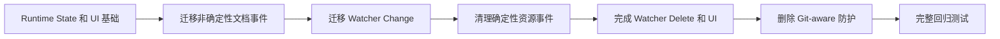

# Git 解耦迁移顺序

本方案按可验证阶段将当前 Git-aware 变化防护替换为 Runtime State 架构，确保新路径稳定后再删除 HEAD、transition 和延迟确认代码。

## 迁移流程

## 实施状态

- 已完成：Runtime State Registry、只读检测、被动检查、Detail/Navigator 展示、Clear Stale、Relocate、确定性 Undo/Redo、非确定性文档事件、Watcher Change、Watcher Delete `missing`，以及文件和目录的 VS Code Rename/Move/Delete/Remove。
- 下一步：完成 Watcher Delete 最终存在性检查和 missing UI 立即刷新。
- 最后：新路径稳定后删除 Git HEAD、transition 和延迟确认代码。

## 阶段说明

### 迁移规则

- 确定性 dirty 编辑继续立即更新 Notes，不等待保存，也不进入 Candidate Registry。
- 非确定性文档事件和 Watcher 只更新 Runtime State。
- VS Code 明确提供路径映射的 Rename/Move/Delete/Remove 属于确定性变化，可以立即更新 Notes。
- 每迁移一个入口，先验证 Note JSON 不会被自动事件修改，再处理下一个入口。
- Git-aware 防护在所有旧入口迁移完成前继续保留。

### 删除 Git-aware 防护

- 从 `extension.ts` 删除 `GitWorkspaceTransitionGuard` 的创建和 Git 监听注册。
- 删除 `workspaceTransition` 目录中的 Git HEAD 监听、transition timer 和 revision token 实现。
- 删除事件注册函数中的 `workspaceTransitionGuard` 参数和分支。
- 删除只验证旧 Git-aware 行为的测试，并用 Runtime State 行为测试替代。
- 删除专门用于“等待 Git HEAD 稳定”的 800ms 延迟确认。

## Debounce 保留边界

- 删除的是依赖时间猜测 Git checkout 是否完成的延迟确认。
- Watcher 重复通知合并、UI refresh 合并和同资源任务串行化仍然有独立价值，可以保留。
- 保留的 debounce 只用于减少重复工作，不得决定是否具有 Note Store 写入权限。
- 确定性写入资格来自 dirty、可确定计算、资源 Gate 和最终有效性检查，而不是“等待足够久”。

## 每阶段完成条件

- 新增路径具有纯逻辑单元测试和对应事件集成测试。
- 非确定性自动检测不会修改 Note JSON 或 `index.json`；确定性 dirty 编辑和用户确认可以修改。
- 快速来回切换分支、`git restore`、外部文件替换和普通手动编辑具有不同但确定的预期结果。
- 当前阶段验证通过前不删除上一阶段的安全保护。
- 最终代码不读取 Git extension API，不保存 HEAD revision，也不依赖 branch transition 状态。

## 当前代码删除范围

- `vscode/services/workspaceTransition/GitWorkspaceTransitionGuard.ts`
- `vscode/services/workspaceTransition/GitAwareSourceChangeGate.ts`
- `vscode/services/workspaceTransition/registerGitWorkspaceTransition.ts`
- `vscode/services/workspaceTransition/index.ts`
- `extension.ts` 中的 Git transition 创建、传递和注册逻辑
- `registerNotesContentEvents` 与 `registerNotesResourceEvents` 中的 Git-aware 参数和判断
- 对应的 Git transition 与 Git-aware Gate 测试

删除动作只能在 Runtime State、统一资源变化和被动一致性检查全部接管后进行。

## 与当前实现的关系

当前代码仍在 `extension.ts` 创建共享的 `GitWorkspaceTransitionGuard`，供尚未迁移的入口和内置 Git HEAD 监听使用。文档事件、Watcher Change/Delete 以及文件和目录资源事件已经迁移；Watcher Delete 收尾与最终 Git-aware 代码清理尚未完成，因此状态为 `proposed`。
