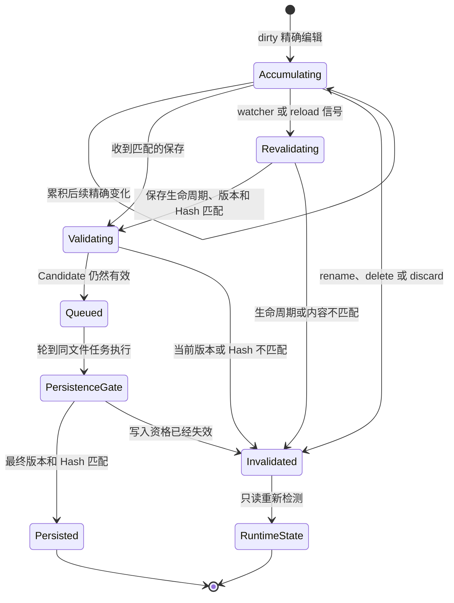

# Relocation Candidate 生命周期

本方案说明确定性 relocation 结果如何在内存中累积、验证和失效，并避免尚未确认的结果直接改写正式 Notes。

## 生命周期

## 关键说明

- Candidate 暂存根据 dirty 精确编辑计算出的 relocation 方案，使“能够计算位置变化”和“允许写入正式 Notes”保持分离。
- 同一文件的后续精确变化累积到当前 Candidate，保存后再按顺序进入同文件任务队列。
- Watcher 或 reload 只要求重新验证；只有保存生命周期、文档版本或当前 Hash 不匹配时，Candidate 才真正失效。
- Rename、delete 或 discard 会使旧路径或已放弃内容对应的 Candidate 直接失效。
- Persistence Gate 在实际写入前再次核对当前版本和 Hash；失败时只生成 Runtime State，不修改 Note JSON 或 `index.json`。

## 与其他架构的关系

- [Runtime State 源文件变更检测](./runtime-state-source-change.md)说明 Candidate 在整体变化分类中的位置。
- [Source Change Persistence Gate](./source-change-persistence-gate.md)说明有效 Candidate 获得正式 Notes 写入资格的条件。
