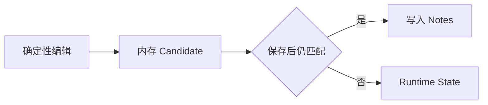

# Relocation Candidate 生命周期（Future Improvement）

这是未采用的可选方案：先把确定性 relocation 暂存在内存，保存后再写入 Notes。当前主线采用“确定性 dirty 编辑立即更新 Notes”，不依赖本方案。

## 生命周期

## 关键说明

- 只有未来发现 dirty 与确定性判断仍不足以保护写入时，才重新评估本方案。
- 引入后会增加内存状态、保存时机、失效和 UI 临时位置等复杂度。
- 当前不建立 Candidate Registry，也不等待 `onDidSaveTextDocument`。

## 与其他架构的关系

- [Runtime State 源文件变更检测](./runtime-state-source-change.md)说明当前采用的主线。
- [Source Change Persistence Gate](./source-change-persistence-gate.md)说明本可选方案需要的配套 Gate。
