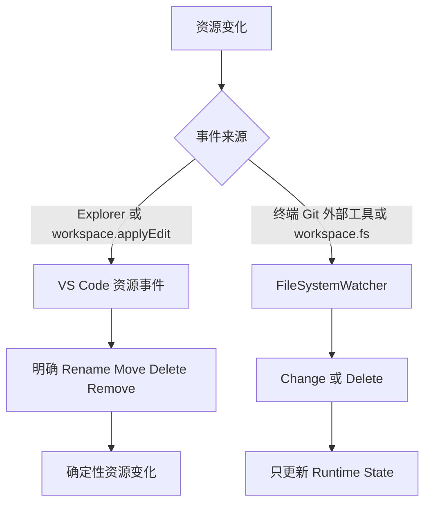
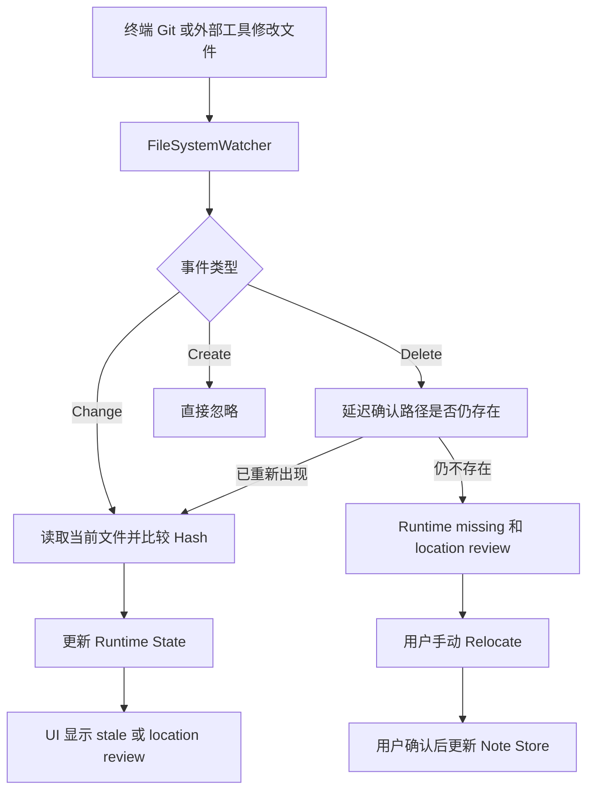

# Resource Change

本方案区分 VS Code 明确资源操作和外部磁盘变化，重点说明可直接更新 Notes 的确定性 Rename、Move、Delete 和 Remove。

## 事件来源

## VS Code 确定性资源事件

- `onDidRenameFiles` 明确提供 `oldUri` 和 `newUri`，同时覆盖 Rename 和 Move。
- `onDidDeleteFiles` 明确提供删除路径，同时覆盖 Delete 和 Remove。
- 文件夹操作只产生一个目录事件，Notes 按该目录路径批量匹配所有已跟踪子文件。
- 通过 Resource Access Gate 后可以立即更新 Note Store。
- 文件或目录 Rename/Move 更新匹配的相对路径，并同步移动对应 Runtime State。
- 文件或目录 Delete/Remove 将匹配的 File Note anchor 标记为 orphaned，并清除对应 Runtime State。

Create 没有旧 Notes 需要迁移；Copy 是否复制 Notes 属于独立产品功能。

## Watcher 非确定性资源事件

- Change 只读检测文本内容或二进制 metadata hash。
- Delete 延迟确认资源仍不存在后记录 session-only `missing`。
- Create 直接忽略，不与 Delete 关联。
- 外部 Rename/Move 不自动更新 Notes，由用户手动 Relocate。
- 系统不保存候选新路径，也不自动修改 Note JSON 或 `index.json`。

## 当前实现边界

- 文本和二进制 Watcher Change 已经只更新 Runtime State。
- 文件和目录的 VS Code Rename/Move/Delete/Remove 已移除旧 Git-aware 延迟，通过 Resource Access Gate 后立即更新 Note Store 和 Runtime State。
- Watcher Change 和 Delete 已接入 Runtime State，均不修改 Note Store。
- VS Code Delete 在 `onWillDeleteFiles` 阶段写入短期标记，抑制随后到达的重复 Watcher Delete；目录标记同时覆盖其子文件事件。
- Watcher Create 保持忽略，外部 Delete/Create 不做 Rename 或 Move 推测。
- 待完成：Watcher Delete 的最终存在性检查，以及 missing 状态的 UI 立即刷新。

总体持久化权限和 Runtime 生命周期见 [Runtime State 总体架构](./runtime-state-architecture.md)。
