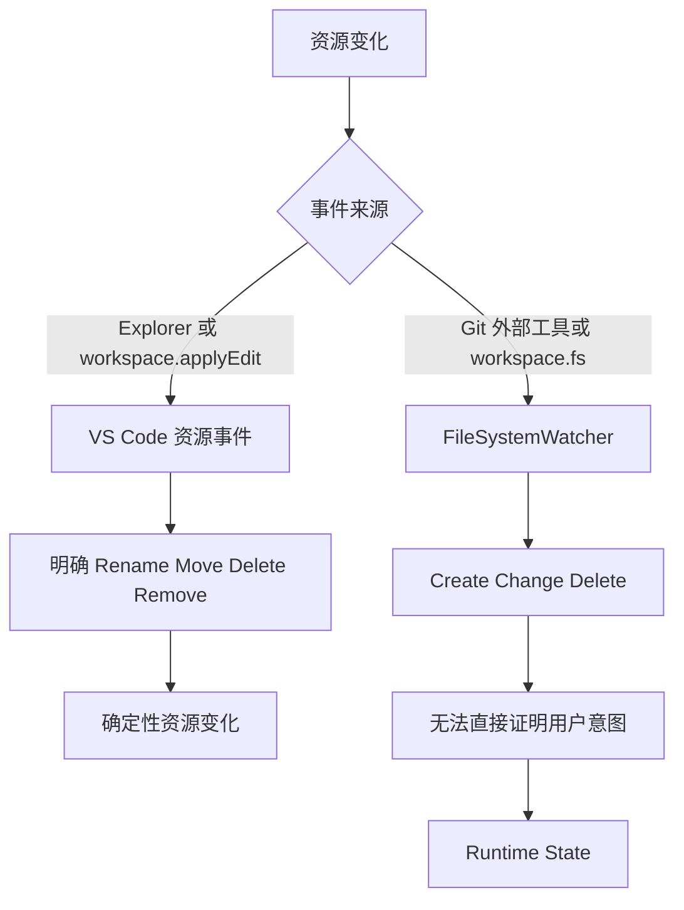

# Resource Change

本方案区分 VS Code 明确资源操作和外部磁盘变化，说明 Rename、Move、Delete、Remove、Create 与 possible rename 的边界。

## 事件来源

## VS Code 确定性资源事件

- `onDidRenameFiles` 明确提供 `oldUri` 和 `newUri`，同时覆盖 Rename 和 Move。
- `onDidDeleteFiles` 明确提供删除路径，同时覆盖 Delete 和 Remove。
- 文件夹操作只产生一个目录事件，Notes 按该目录路径批量匹配所有已跟踪子文件。
- 通过 Resource Access Gate 后可以立即更新 Note Store。
- 文件或目录 Rename/Move 更新匹配的相对路径，并同步移动对应 Runtime State。
- 文件或目录 Delete/Remove 将匹配的 File Note anchor 标记为 orphaned，并清除对应 Runtime State。

Create 没有旧 Notes 需要迁移；Copy 是否复制 Notes 属于独立产品功能。

## Watcher 非确定性资源事件

- Change 只读检测文本内容或二进制 metadata hash。
- Delete 只说明旧路径消失，应记录 `missing`。
- Create 只说明新路径出现，不能单独证明它来自 Rename。
- 根据相近 Delete 和 Create 推测 Rename 时，只记录 `possible rename`。
- 用户确认前必须重新读取当前资源；忽略状态时不修改 Note Store。

## 当前实现边界

- 文本和二进制 Watcher Change 已经只更新 Runtime State。
- 文件和目录的 VS Code Rename/Move/Delete/Remove 已移除旧 Git-aware 延迟，通过 Resource Access Gate 后立即更新 Note Store 和 Runtime State。
- 当前 Watcher 尚未监听 Create/Delete。
- 下一步实现 Watcher 的 `missing` 和 `possible rename`。

总体持久化权限和 Runtime 生命周期见 [Runtime State 总体架构](./runtime-state-architecture.md)。
