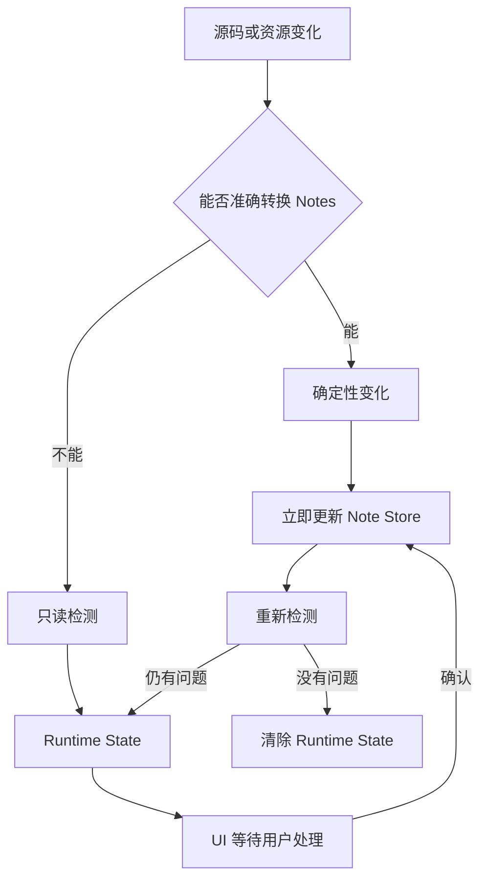
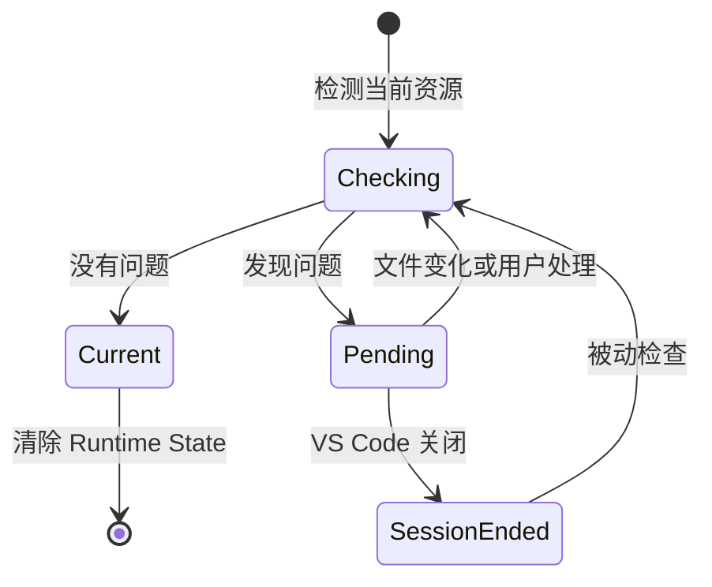

# Runtime State 总体架构

本方案统一说明变化分类、持久化边界和 Runtime State 生命周期；源码与资源的转换细节由下级文档说明。

## 总体流程

确定性变化必须同时满足：事件来源明确、旧状态和新状态能够准确对应、Notes 转换规则没有歧义，并且 Resource Access Gate 允许目标资源。

## 生命周期

- `Checking`：读取当前资源并与 Note Store 比较。
- `Pending`：Registry 保存待处理状态，UI 显示 `stale`、`location review`、`missing` 或 `possible rename`。
- `Current`：当前资源与 Notes 一致，可以清除对应 Runtime State。
- `SessionEnded`：内存状态随 Extension Host 会话结束而丢失，重新打开后按需检测。

## 变化分类

### 确定性变化

- VS Code dirty 文本事件中的可计算插入、删除和替换。
- 存在匹配 relocation history 的 VS Code Undo 和 Redo。
- VS Code `onDidRenameFiles` 提供的 Rename 或 Move。
- VS Code `onDidDeleteFiles` 提供的 Delete 或 Remove。
- 用户明确执行的 Clear Stale、Relocate 或其他确认操作。

确定性内容变化见 [Source Relocation](./source-relocation.md)，确定性资源变化见 [Resource Change](./resource-change-handling.md)。

### 非确定性变化

- 无法准确分类的 dirty 文本事件。
- `isDirty=false` 的 reload、文件替换和保存检查。
- Watcher 检测到的文本或二进制 Change。
- Watcher 检测到的 Create 或 Delete，以及根据两者推测的 Rename。
- Git checkout、merge、restore 或其他外部磁盘变化。
- 插件启动、打开文件或切换编辑器时的被动检查。

这些变化只读检测当前资源，不自动改写 Note Store。

## 数据边界

### Runtime State 只保存在内存

- 自动检测产生的 `stale`、`location review`、`missing` 和 `possible rename`。
- 当前路径、当前 Hash、检测原因、发现时间和可选建议位置。
- UI 待处理提示和会话中的临时选择。

Registry 只保存受影响资源，不保存整个项目快照。状态不会定时重试；新事件、用户操作或被动检查才会重新检测。

### Note Store 保存在磁盘

- File、Section 和 Line Note 的 User/AI 内容。
- 已确认的文件路径、Section 范围、Line 行号和 anchor。
- 正式内容基线 `sourceHash`、状态和 `updatedAt`。
- 确定性变化或用户确认形成的正式结果。

## 持久化规则

- 用户确认 Runtime State 前必须重新读取当前资源并核对 Hash。
- Runtime State 的建议范围和行号不能直接覆盖正式位置。
- Clear Stale 只确认 `content`；Relocate 只确认位置和 anchor。
- 确定性写入或用户确认成功后，统一重新检测，不手动拼接剩余状态。
- 写入失败时保留 Runtime State 供用户重试。
- 用户忽略状态时 Note Store 保持不变。

## 当前实现边界

- 已完成：确定性 dirty relocation、Undo/Redo、非确定性文档检测、文本/二进制 Watcher Change、被动检查、Runtime UI、Clear Stale、Relocate，以及文件和目录的 VS Code Rename/Move/Delete/Remove。
- 待完成：Watcher Create/Delete、`missing` 和 `possible rename`。
- 最后删除剩余 Git-aware transition 和 revision 代码。
