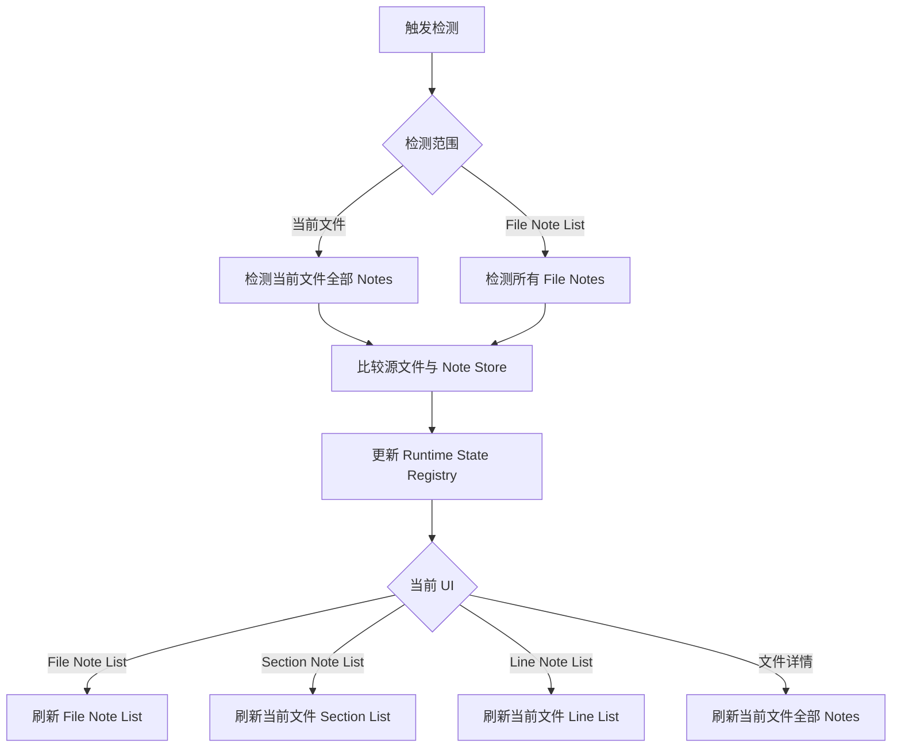
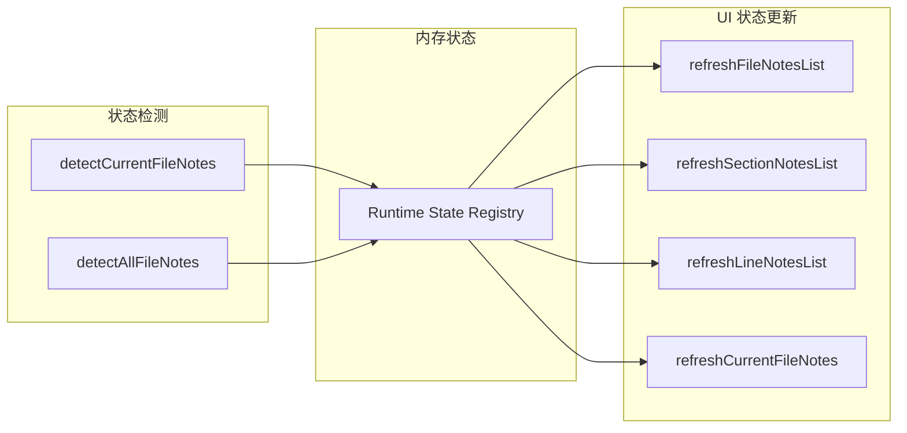

# 状态检测与 UI 状态更新

本方案将“重新判断 Notes 是否过期”和“把判断结果显示到界面”分开，避免把刷新 UI 误认为重新检测。

## 核心流程

## 公共入口

- **状态检测**：读取源文件和 Note Store，重新判断 `stale`、`location review`、`missing` 等状态。
- **UI 状态更新**：读取 Note Store 与 Registry 中已有的结果并重新显示，不自行判断状态。
- **Registry**：保存本次 Extension Host 会话已经检测出的异常状态；它不是完整项目快照。
- `detectCurrentFileNotes` 一次检测当前文件的 File、Section 和 Line Notes，避免重复读取同一个文件。
- `detectAllFileNotes` 只补齐全部 File Notes 的状态，不扫描所有文件的 Section 和 Line Notes。

## 调用规则

- 打开或切换到文件详情：检测当前文件全部 Notes，然后刷新文件详情。
- 打开 Section Note List：检测当前文件全部 Notes，然后只刷新 Section List。
- 打开 Line Note List：检测当前文件全部 Notes，然后只刷新 Line List。
- 打开 File Note List：检测所有 File Notes，然后刷新 File Note List。
- Registry 状态变化：只刷新受影响的当前界面，不重复执行同一次检测。

## 当前边界

当前已建立 `detectCurrentFileNotes` 和 `detectAllFileNotes` 公共检测入口，Notes UI 的手动 Relocate 后检测以及源码内容事件已复用当前文件入口。

尚未完成：File、Section、Line 列表切换时的独立触发消息，以及三个列表级 UI 刷新入口；因此本文整体仍标记为 `proposed`。
