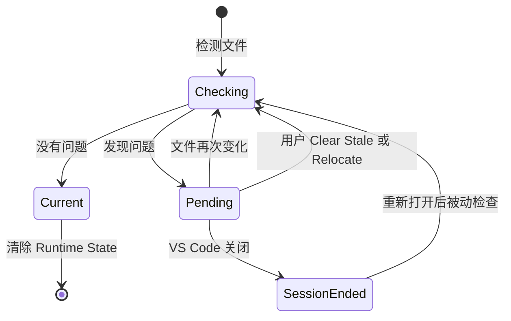

# Runtime State 生命周期

本方案说明一个源文件的临时检测状态如何被发现、等待处理、重新验证，并最终解决或在重启后恢复检查。

## 简化生命周期

## 状态说明

- `Checking`：读取当前文件并与 Note Store 比较。
- `Pending`：Runtime State Registry 保存待处理状态，UI 可以显示 `stale`、`location review`、`missing` 或 `possible rename`。
- `Current`：Notes 无需处理，可以清除对应 Runtime State。
- `SessionEnded`：内存状态随会话结束而丢失，重启后通过被动一致性检查重新发现仍存在的问题。

## 触发规则

- `Pending` 不会定时自动重试；只有新的文件事件、用户操作或被动检查才能推动状态变化。
- 文件再次变化时，应覆盖同一路径的旧检测结果，并用最新内容和 Hash 重新计算。
- 用户操作前必须重新核对当前文件；写入失败时保留 `Pending` 供用户重试。
- 只有进入 `Current` 后，才能清除对应的 Runtime State。
- VS Code 重启后不恢复旧的内存对象，而是依据当前源文件与 Note Store 重新检测。

## 与其他架构的关系

- [Runtime State 源文件变更检测](./runtime-state-source-change.md)说明状态变化的三种检测来源。
- [Runtime State 与 Note Store 持久化边界](./runtime-state-persistence-boundary.md)说明哪些数据停留在内存，哪些结果可以写入磁盘。

## 与当前实现的关系

Runtime State Registry、被动检查、Detail/Navigator 状态展示、Clear Stale 和 Relocate 已实现。非确定性实时事件、Watcher、Rename 和 Delete 尚未全部迁移。
