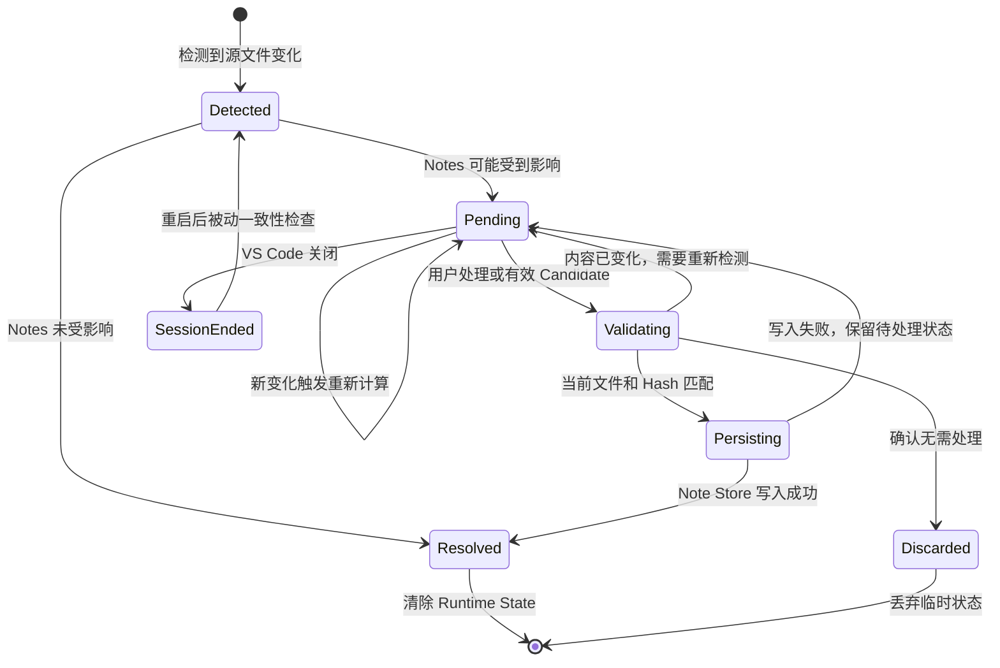

# Runtime State 生命周期

本方案说明一个源文件的临时检测状态如何被发现、等待处理、重新验证，并最终解决或在重启后恢复检查。

## 生命周期

## 状态说明

- `Detected`：变化来源已经发现某个文件可能改变，但尚未判断 Notes 是否受到影响。
- `Pending`：Runtime State Registry 保存待处理状态，UI 可以显示 `stale`、`location review`、`missing` 或 `possible rename`。
- `Validating`：用户操作或有效 Candidate 触发重新读取，并核对路径、当前内容和 `sourceHash`。
- `Persisting`：验证通过，正在把正式结果写入 Note JSON 和 `index.json`。
- `Resolved`：Notes 无需修改或已经成功更新，可以清除对应 Runtime State。
- `Discarded`：旧 Candidate 或临时状态已确认没有继续处理的必要。
- `SessionEnded`：内存状态随会话结束而丢失，重启后通过被动一致性检查重新发现仍存在的问题。

## 触发规则

- `Pending` 不会定时自动重试；只有新的文件事件、用户操作、有效 Candidate 或被动检查才能推动状态变化。
- 文件再次变化时，应覆盖同一路径的旧检测结果，并用最新内容和 Hash 重新计算。
- 验证失败不是持久化失败：前者返回 `Pending` 重新检测，后者保留 `Pending` 供用户重试。
- 只有进入 `Resolved` 或 `Discarded` 后，才能清除对应的 Runtime State。
- VS Code 重启后不恢复旧的内存对象，而是依据当前源文件与 Note Store 重新检测。

## 与其他架构的关系

- [Runtime State 源文件变更检测](./runtime-state-source-change.md)说明状态变化的三种检测来源。
- [Runtime State 与 Note Store 持久化边界](./runtime-state-persistence-boundary.md)说明哪些数据停留在内存，哪些结果可以写入磁盘。
- [Source Change Persistence Gate](./source-change-persistence-gate.md)说明 Candidate 进入 `Persisting` 前必须满足的条件。

## 与当前实现的关系

当前实现尚未建立独立的 Runtime State Registry，部分 stale、anchor 和 `sourceHash` 状态仍直接写入 Note Store。本图描述替换 Git 相关变化防护后的目标生命周期，因此状态为 `proposed`。
