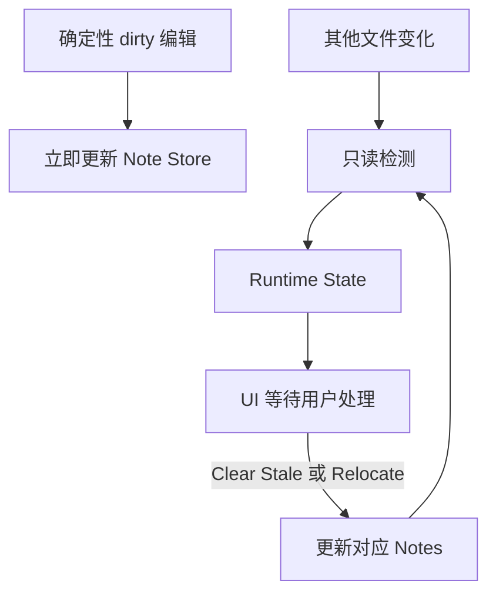

# Runtime State 与 Note Store 持久化边界

本方案将自动检测得到的`临时状态`与`用户笔记内容`分开管理，避免外部文件变化直接改写 Note JSON 或 `index.json`。

## 核心边界

## 只保存在内存

- 自动检测产生的 `stale`、`location review`、`missing` 和 `possible rename` 状态。
- 当前源文件路径、当前 `sourceHash`、检测原因和发现时间等重新验证所需信息。
- UI 的待处理提示、筛选状态和本次会话中的临时选择。

这些数据用于提示和重新验证，不自动改写 Note JSON 或 `index.json`。关闭 VS Code 后可以丢失，重新打开时由被动一致性检查按需恢复。

## 可以写入 Note Store

- 用户直接创建或修改的 File、Section、Line Note 内容。
- 用户确认 stale、relocate、rename、delete 或其他待处理状态后形成的正式结果。
- `isDirty=true` 且可以准确计算的 Section 和 Line relocation 结果。
- 与正式结果对应的 Note 状态、锚点、范围、`sourceHash` 和 `updatedAt`。

所有由检测状态转成正式结果的写入，都必须在持久化前重新读取目标文件并核对当前 Hash；用户直接编辑笔记仍需通过 [Czaza 资源访问 Gate](./czaza-resource-access-gate.md)。

## 边界规则

- 非确定性 VS Code 文档事件、Watcher 和被动检查只负责发现变化，不直接授予写盘权限。
- Runtime State Registry 只保存受影响文件，不保存整个项目的文件快照。
- Runtime State 只有在新的文件事件、用户操作或被动检查触发后才会重新检测。
- `sourceHash` 用于判断内存状态是否仍对应当前文件内容，不用于依赖 Git 历史。
- 用户忽略待处理状态时，Note Store 保持不变。
- 用户确认位置后只写入目标范围、行号和 anchor，不更新代表文件内容基线的 `sourceHash`。
- Section 或 Line relocate 成功后，通过统一检测入口重新计算当前文件的完整 Runtime State，不手动拼接剩余状态。
- 重新检测只会消除已经确认的 Location Review；仍可由旧 `sourceHash` 检出的 Content stale 必须保留。
- 用户确认或确定性写入成功后，才重新计算或清除对应 Runtime State。
- Note Store 写入失败时保留 Runtime State，以便重试，不得把 UI 状态误报为已处理。
- Clear stale 只确认 `content`，必须原样保留 `anchor` 和候选位置；未确认的位置仍继续显示 Location Review，并单独走 relocate。
- Runtime State 中的候选范围和行号不得直接覆盖 Detail 或 Navigator 的持久化位置；它们只能作为 relocate 的辅助输入。

## 与当前实现的关系

当前 File Notes 详情页和 Navigator 已经展示 Runtime State，并允许用户分别处理 stale 内容和位置。非确定性实时事件、Watcher、Rename 和 Delete 仍需迁移；旧 Git Gate 暂时继续保护这些路径。
