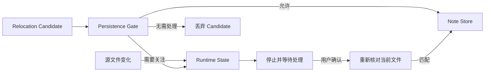
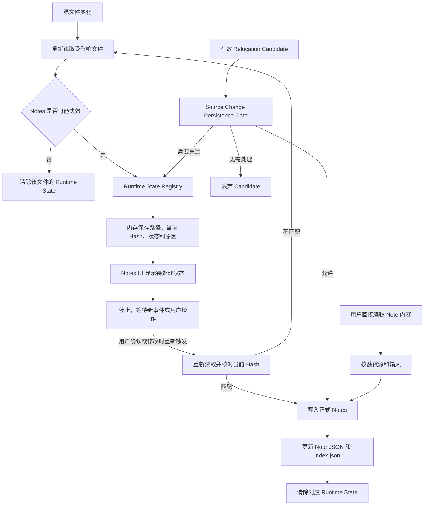

# Runtime State 与 Note Store 持久化边界

本方案将自动检测得到的`临时状态`与`用户笔记内容`分开管理，避免外部文件变化直接改写 Note JSON 或 `index.json`。

## 概览图

概览图只展示临时检测状态与正式 Notes 之间的核心持久化边界。

## 完整流程图

完整流程图补充变化检查、Hash 复核、用户直接编辑和 Runtime State 清理路径。

## 只保存在内存

- 自动检测产生的 `stale`、`location review`、`missing` 和 `possible rename` 状态。
- 当前源文件路径、当前 `sourceHash`、检测原因和发现时间等重新验证所需信息。
- 尚未通过 Persistence Gate 的 relocation candidate。
- UI 的待处理提示、筛选状态和本次会话中的临时选择。

这些数据用于提示和重新验证，不自动改写 Note JSON 或 `index.json`。关闭 VS Code 后可以丢失，重新打开时由被动一致性检查按需恢复。

## 可以写入 Note Store

- 用户直接创建或修改的 File、Section、Line Note 内容。
- 用户确认 stale、relocate、rename、delete 或其他待处理状态后形成的正式结果。
- 通过 [Source Change Persistence Gate](./source-change-persistence-gate.md) 的确定性 relocation 结果。
- 与正式结果对应的 Note 状态、锚点、范围、`sourceHash` 和 `updatedAt`。

所有由检测状态转成正式结果的写入，都必须在持久化前重新读取目标文件并核对当前 Hash；用户直接编辑笔记仍需通过 [Czaza 资源访问 Gate](./czaza-resource-access-gate.md)。

## 边界规则

- Watcher、VS Code 文档事件和被动检查只负责发现变化，不直接授予写盘权限。
- Runtime State Registry 只保存受影响文件，不保存整个项目的文件快照。
- Persistence Gate 返回“需要关注”时只记录 Runtime State 并停止，不会立即重新运行 Gate。
- Persistence Gate 返回“无需处理”时直接丢弃 Candidate，不创建无意义的 Runtime State。
- Runtime State 只有在新的文件事件、用户操作或被动检查触发后才会重新检测。
- `sourceHash` 用于判断内存状态是否仍对应当前文件内容，不用于依赖 Git 历史。
- 用户忽略待处理状态时，Note Store 保持不变。
- 用户确认或有效 Candidate 写入成功后，才清除对应 Runtime State。
- Note Store 写入失败时保留 Runtime State，以便重试，不得把 UI 状态误报为已处理。
- Clear stale 只能确认 `anchor=confirmed` 且建议位置未变化的 Runtime State；需要位置确认的目标必须继续走 relocate。
- Runtime State 中的候选范围和行号不得直接覆盖 Detail 或 Navigator 的持久化位置；它们只能作为 relocate 的辅助输入。

## 与当前实现的关系

当前 File Notes 详情页和 Navigator 已经展示 Runtime State，并允许用户在当前 Hash 匹配时确认纯 stale 内容；成功后重新检测并协调 Registry。Location review 确认、Candidate Persistence Gate 和实时事件迁移仍未实现，Git 相关 Gate 继续用于降低旧事件路径在分支切换期间的误写风险。
