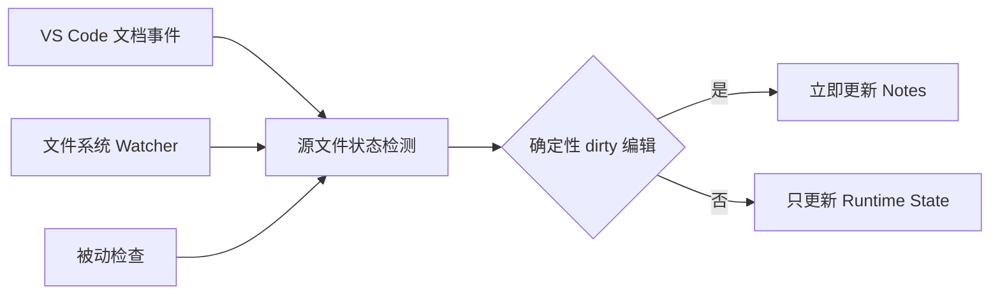
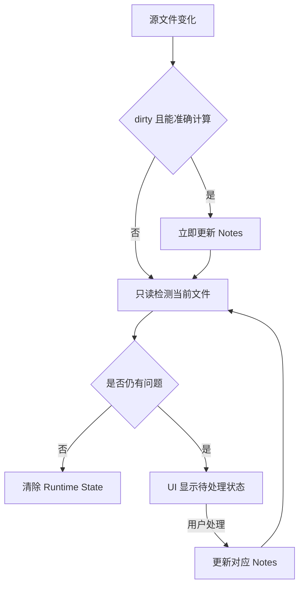

# Runtime State 源文件变更检测

本方案使用一条核心规则：能准确计算的位置变化立即更新 Notes，其他变化只在内存中提示用户。

## 变化来源

三个入口最终共享同一条判断规则；入口只说明变化从哪里被发现，不决定是否可以写入 Notes。

- VS Code 文档事件：编辑器内输入、删除或接受 Copilot 插入。
- 文件系统 Watcher：Git、外部工具或磁盘操作改变文件。
- 被动检查：首次打开文件、切换编辑器或显式检查。

## 核心流程

## 名词解释

- **Dirty**：编辑器内容尚未保存到磁盘，例如手动输入或接受 Copilot 建议后，VS Code 通常会标记为 dirty。
- **确定性修改**：能够准确算出新位置的编辑，例如在 Line Note 前插入一行时，行号确定增加一。
- **Runtime State**：只保存在 Extension Host 内存中的待处理提醒，不直接修改 Note JSON。
- **建议位置**：检测器认为 Section 或 Line 可能移动到的位置，只供 Relocate 使用，确认前不覆盖正式位置。
- **Note Store**：`.czaza/notes` 中正式保存 File、Section 和 Line Notes 的数据。

## 当前规则

- `isDirty=true` 且变化可以确定性计算时，立即更新 Section 范围、Line 行号及对应 Notes。
- VS Code 非确定性变化、`isDirty=false` 的文档变化和保存检查只更新 Runtime State，不写入 Note Store。
- Watcher 文本变化经过 debounce 后，与 VS Code 文档事件共用逐文件队列并只更新 Runtime State。
- 确定性整体移动只改变坐标，保留原有 `content` 和 `anchor` 状态。
- Line Note 行首 Enter 确定移动，行中 Enter 需要 Location Review，行尾 Enter 不改变该 Line Note。
- 被动检查只读检测当前内容，并把结果放入 Runtime State。
- Clear Stale 只处理内容状态；Relocate 只处理位置状态；完成后重新检测整个文件。
- Runtime State 关闭 VS Code 后可以丢失，重新打开时由被动检查恢复。

## 当前风险

- Watcher 二进制路径仍可能调用旧服务修改 Note Store。
- `isDirty` 能覆盖常见编辑场景，但某些插件也可能制造 dirty 编辑。
- Rename 和 Delete 仍使用旧的 Git-aware 延迟后直接更新 Note Store。

## 下一步

为 Watcher 二进制变化补充只读 Runtime State 检测；随后再迁移 Rename 和 Delete。

## Future Improvements

- 更可靠地区分用户编辑与其他扩展产生的 dirty 编辑。
- 多窗口同时编辑同一文件时增加文档版本校验。
- 如果未来确实需要保存前暂存确定性结果，再评估 [Relocation Candidate 生命周期](./relocation-candidate-lifecycle.md)；当前主线不采用。
