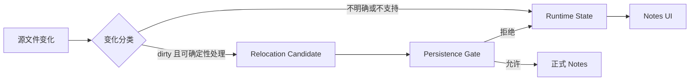
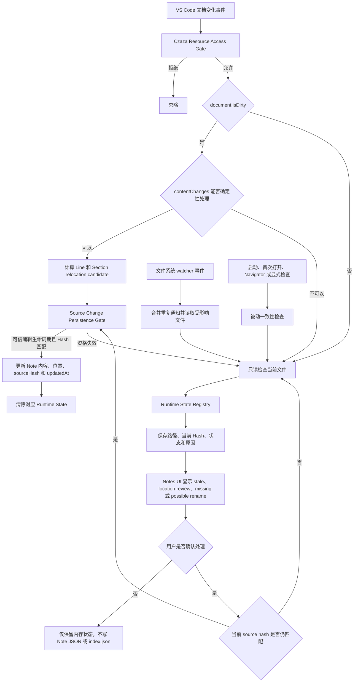

# Runtime State 源文件变更检测

本方案将源文件变化检测与 Git 解耦，并在内存中管理尚未由用户确认的笔记状态。

## 概览图

概览图只展示源文件变化从分类到正式 Notes 或 Runtime State 的核心去向。

- **Dirty**：VS Code 文档的内存内容与磁盘上最后保存的内容不一致，通常表示存在尚未保存的编辑。
- **Candidate**：暂存“Notes 应如何 relocation”的计算结果，用来分开“能够算出位置变化”和“确认可以安全写盘”；例如在第 10 行前插入 3 行时先保留后续 Line 和 Section 向后移动 3 行的方案，只有匹配的保存、文档版本和当前 Hash 均通过验证后才可写入正式 Notes，详见 [Relocation Candidate 生命周期](./relocation-candidate-lifecycle.md)。

## 详细流程图

详细流程图展示三种变化来源、VS Code 文档事件分类、状态管理、确认失败后的重新检测及最终持久化边界。

## 责任边界

- 所有 VS Code 文档变化必须先通过 [Czaza 资源访问 Gate](./czaza-resource-access-gate.md)，工作区外、Root 外和 Czaza Note Store 文件不得进入源码检测。
- 只有 `isDirty=true` 且 `contentChanges` 能够确定性分类的 VS Code 文档变化，才能生成 relocation candidate。
- 确定性只表示能够准确计算 relocation candidate，不代表具备持久化权限。
- `Source Change Persistence Gate` 必须独立验证可信编辑生命周期、候选有效性和当前 `sourceHash`。
- 文件系统 watcher 只检查事件涉及的文件，并合并短时间内的重复通知。
- 被动一致性检查用于重启后的恢复和按需补检，不持续扫描整个工作区。
- `Runtime State Registry` 只保存非当前状态的受影响文件，不保存全量文件快照。
- 模糊的外部变化只更新内存状态，不自动改写 Note JSON 或 `index.json`。
- 用户确认或确定性编辑准备持久化时，必须再次核对当前 `sourceHash`。
- Runtime State 至少包含文件路径、当前 hash、状态，以及可选的变化原因。

## 状态范围

- `stale`：源内容已经变化，笔记内容可能需要更新。
- `location review`：Section 或 Line 的锚点位置需要确认。
- `missing`：原路径当前不存在。
- `possible rename`：发现可能对应同一资源的新路径，但尚未由用户确认。

## 与当前实现的关系

当前实现仍使用 `GitWorkspaceTransitionGuard`、`GitAwareSourceChangeGate` 和 Git HEAD 监听来延迟或取消自动写入。本图描述的是替代该机制的目标架构；在 Runtime State 工作流完成并通过验证前，不应删除现有 Git 防护。

检测结果进入内存或磁盘的具体边界见 [Runtime State 与 Note Store 持久化边界](./runtime-state-persistence-boundary.md)。
