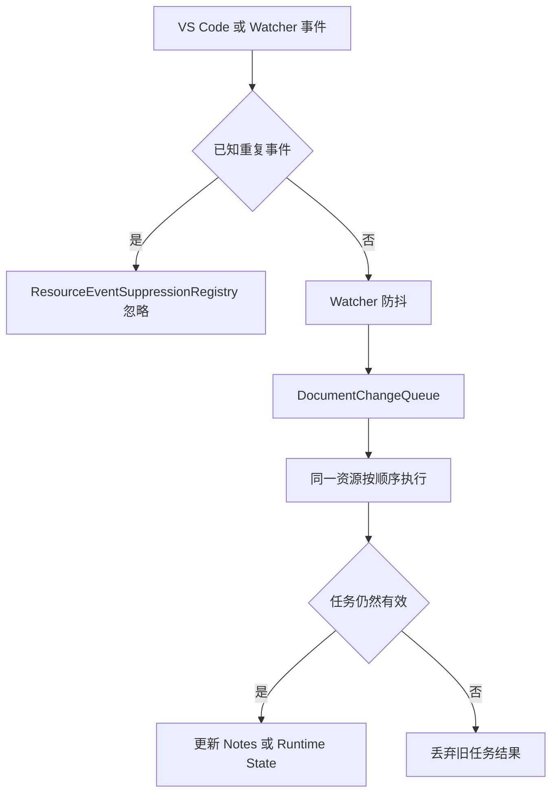

# 源码与资源变化任务协调

本架构说明 CZaza 如何过滤重复事件、合并高频事件、串行执行同一资源的任务，并阻止过期任务应用结果。

## 简单流程



确定性 VS Code 文档事件不等待 Watcher 防抖，但仍可进入同一资源的队列；Watcher Change 和 Delete 先经过防抖再进入队列。

## 术语

- `ResourceEventSuppressionRegistry`：短期记录已经由 VS Code 确定性处理的资源事件，用于忽略随后到达的重复 Watcher 事件。
- 防抖（debounce）：同一资源在短时间内连续产生多个 Watcher 事件时，只保留最后一次任务。
- `DocumentChangeQueue`：按资源 URI 保存等待执行的 Promise 链，是当前队列的具体实现。
- 队列串行化：同一资源的任务一个接一个执行，避免两个异步任务同时更新状态。
- 任务失效（invalidation）：当 Note Store 或执行环境已经变化时，让早先创建的任务不能再应用旧结果。
- token：任务开始时取得的轻量版本标记；执行前后用它判断任务是否已经失效。

## 简单示例

### VS Code 删除与重复 Watcher Delete

```text
VS Code 删除文件
→ 确定性 Delete 已经更新 Notes
→ ResourceEventSuppressionRegistry 记录该路径
→ Watcher 随后报告同一路径 Delete
→ 识别为重复事件并忽略
```

### Watcher 连续报告文件变化

```text
同一文件连续收到 3 次 Watcher Change
→ 防抖只保留最后一次
→ 任务进入该文件的 DocumentChangeQueue
→ 等前一个任务完成后执行
→ token 仍有效才更新 Runtime State
```

### 等待期间 Note Store 被外部修改

```text
Watcher 检测任务正在等待
→ .czaza/notes 被外部工具修改
→ Note Store 缓存清除并使旧 token 失效
→ 旧任务即使完成也不能应用结果
```

## 职责边界

- Suppression 处理“已经明确知道是重复”的事件。
- 防抖处理“短时间重复但无法逐个判断来源”的 Watcher 事件。
- Queue 解决同一资源异步任务的执行顺序，不负责判断事件是否重复。
- Invalidation 保护任务结果的时效性，不负责安排执行顺序。
- Runtime State 保存检测结果，不负责事件协调。

## 当前实现

- `ChangeTaskCoordinator` 统一拥有 Watcher 防抖、按资源队列、revision token 和任务失效。
- `ResourceEventSuppressionRegistry` 位于同一 `changeCoordination` 目录，由 Controller 组合并提供 Delete suppression。
- `registerNotesContentEvents` 使用 Controller 协调确定性文档事件和 Watcher Change/Delete。
- `registerNotesResourceEvents` 使用同一个 Controller 标记确定性 VS Code Delete。
- Controller 不读取 Git 状态；checkout、merge 和 restore 产生的文件变化与普通外部变化使用同一协调流程。

源码位置转换规则见 [Source Relocation](./source-relocation.md)，外部资源事件分类见 [Resource Change](./resource-change-handling.md)。
