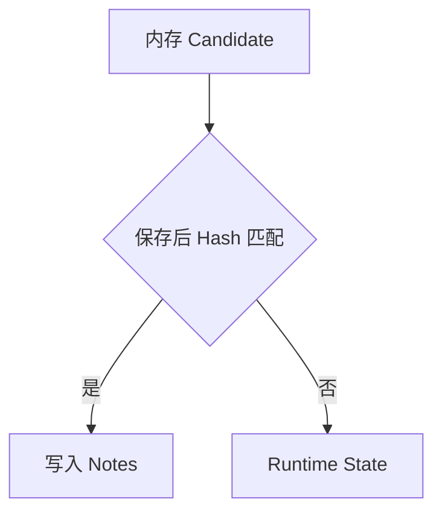

# Source Change Persistence Gate（Future Improvement）

这是与 Candidate Registry 配套的未采用方案。当前确定性 dirty 编辑立即更新 Notes，非确定性变化进入 Runtime State。

## 可选流程

## 采用条件

- 只有出现无法通过当前简单规则解决的真实写入错误时，才考虑引入。
- 引入时至少需要 Candidate Registry、文档版本、预期 Hash、保存监听和失效规则。
- 数据安全问题可以触发重新评估；普通边界情况继续放在 Future Improvements。

## 与当前实现的关系

当前未实现 Candidate Registry 或本 Gate。`registerNotesContentEvents` 对确定性 dirty 编辑直接计算并写入 Notes。
