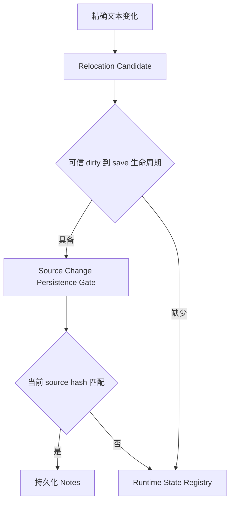
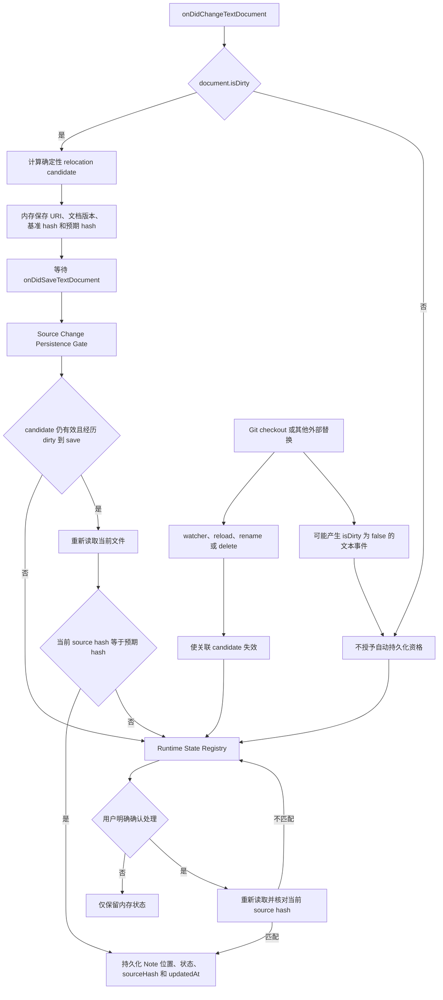

# Source Change Persistence Gate

本方案将 relocation 的计算确定性与 Notes 的持久化权限分离，避免 Git checkout 等外部变化直接改写笔记。

## 简版

简版展示 relocation candidate 从可信编辑生命周期进入受控持久化的核心条件。

## 完整版

完整版展示 candidate 的创建、失效、保存资格、Hash 复查，以及用户确认后的重新进入路径。

## Gate 输入

- relocation candidate，包括目标 URI、文档版本、基准 `sourceHash` 和预期 `sourceHash`。
- 文档是否经历 `isDirty` 为真的文本变化以及后续 `onDidSaveTextDocument`。
- watcher、reload、rename 或 delete 是否使 candidate 失效。
- 持久化前重新读取的当前文件内容和 `sourceHash`。
- 用户是否明确确认处理 Runtime State。

## Gate 输出

- `persist`：candidate、编辑生命周期和当前 Hash 均有效，可以写入 Notes。
- `runtimeState`：变化存在但没有自动持久化资格，只更新内存状态。
- `cancelled`：candidate 已失效，不得继续使用旧计算结果。

## 约束

- 确定性 splice 只证明 relocation 可以计算，不能单独授予持久化权限。
- Auto Save 可以完成可信的 dirty 到 save 生命周期。
- Copilot 或其他编辑器功能产生的正常文本编辑，只要进入 dirty 并随后保存，也可以获得资格。
- 外部文件替换不得因为变化形状可以确定计算而直接写入 Note JSON 或 `index.json`。
- 最终 `sourceHash` 校验必须紧邻持久化操作，避免检查后文件再次变化。

## 与当前实现的关系

当前 `registerNotesContentEvents` 会在 `onDidChangeTextDocument` 后调用 `applySourceChangeToNotesService`，并通过 `GitAwareSourceChangeGate` 延迟和校验写入。目标 Gate 将 candidate 保留在内存中，直到可信保存或用户确认后才允许持久化，因此不再依赖 Git HEAD 或 branch transition。
