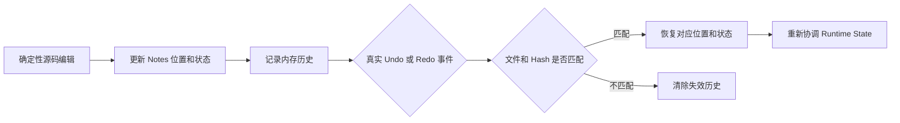
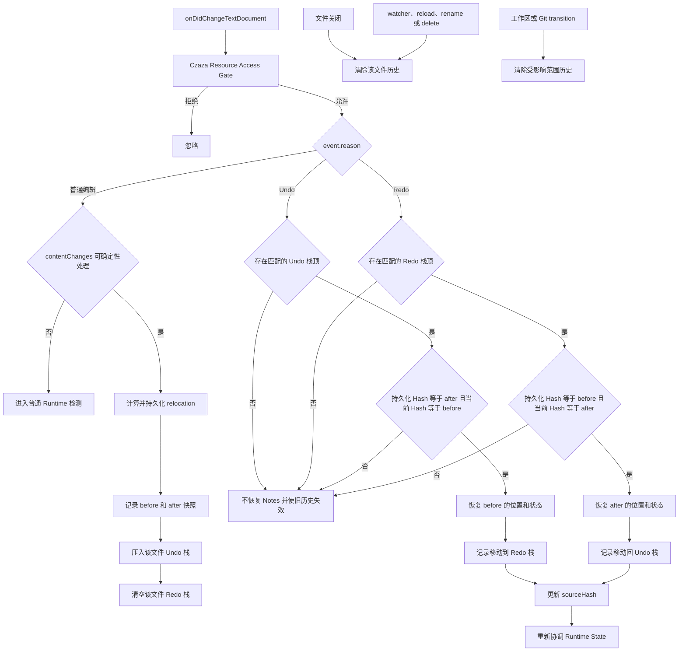

# Source Relocation Undo/Redo 历史

本方案说明确定性源码编辑如何在内存中记录 relocation 前后状态，并只在真实 VS Code Undo/Redo 事件和 Hash 完全匹配时恢复 Notes。

## 简版

## 完整版

## 历史记录内容

- 文档 URI，以及修改前后的 `sourceHash`。
- File Note 修改前后的 `status`。
- 受影响 Section 的 `id`、`range` 和 `status`。
- 受影响 Line Note 的 `id`、`line` 和 `status`。
- 不保存源码全文、User Note、AI Note、Title 或其他用户内容。

## 触发边界

- 只响应真实的 `onDidChangeTextDocument`，不监听 Ctrl+Z 或 Redo 键盘快捷键。
- `event.reason` 必须为 VS Code 的 Undo 或 Redo，并且 `contentChanges` 不能为空。
- Undo 后即使文档恢复为 `isDirty=false`，只要事件和 Hash 与历史匹配，仍可恢复 Notes。
- 在 WebView、Terminal 或其他文件中执行 Undo，不会命中当前源文件的历史。
- 没有历史或 Hash 不匹配时不得猜测恢复；旧历史失效并转入正常检测路径。

## 状态恢复规则

- Undo 恢复 before 的 Section 范围、Line 行号、持久化状态和 `sourceHash`。
- Redo 恢复 after 的对应字段。
- 修改前已经 stale 的目标在 Undo 后仍恢复为 stale，不统一清除状态。
- Runtime State 不进入历史；正式字段恢复后根据当前 Hash 重新协调。
- 每个文件的历史应设置容量上限，例如 100 条，避免长期编辑导致无界增长。

## 与其他架构的关系

- [Runtime State 源文件变更检测](./runtime-state-source-change.md)说明历史失效后进入的只读检测路径。
- [Relocation Candidate 生命周期](./relocation-candidate-lifecycle.md)说明普通确定性编辑在获得持久化资格前的状态。
- [Source Change Persistence Gate](./source-change-persistence-gate.md)说明普通编辑及历史恢复写入 Note Store 前的校验边界。

## 当前实现

- `SourceRelocationHistoryService` 为每个文档 URI 保存最多 100 条 Undo 记录，并维护独立 Redo 栈。
- `applySourceRelocationHistoryService` 在写入前核对持久化 Hash 和 Undo/Redo 后的当前文档 Hash，成功保存后才移动栈记录。
- `registerNotesContentEvents` 只响应真实 `TextDocumentChangeReason.Undo` 或 `Redo`；普通确定性编辑成功后记录 before/after。
- 历史恢复只覆盖 `sourceHash`、File Note 状态、Section 范围与状态，以及 Line Note 行号与状态。
- Source Note 内容、User Note、AI Note、Title、锚点文本和其他用户数据始终使用当前持久化对象，不从历史快照覆盖。
- 文档关闭、非保存 watcher 变化、rename、delete、Git transition 和扩展释放都会清除相关历史。
- 第一版历史仅存在于当前 Extension Host 会话，不跨 VS Code 重启恢复。
