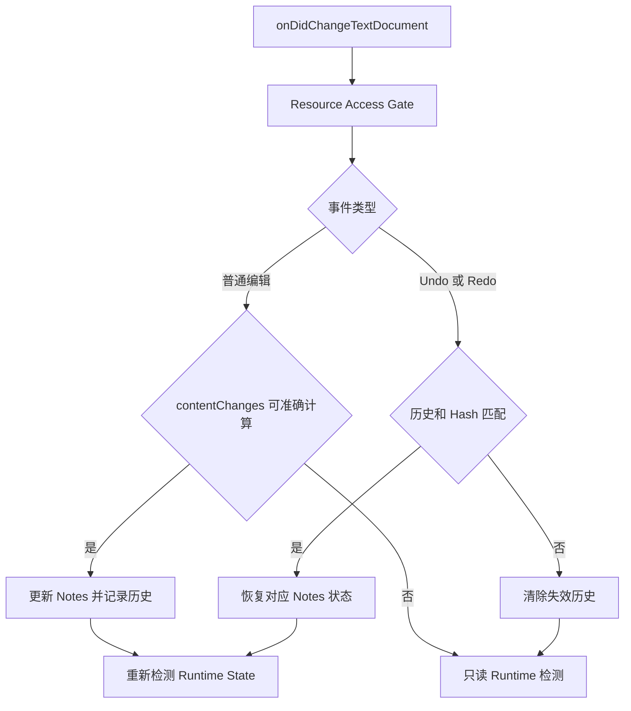

# Source Relocation

本架构说明 VS Code 确定性源码编辑如何更新 Section、Line 和 source hash，以及 Undo/Redo 如何安全恢复历史。

## 处理流程

## 确定性编辑规则

- `isDirty=true` 且 splice 可以准确计算时，立即更新 Section 范围、Line 行号和 `sourceHash`。
- 在 Section 前方插入或删除行时，整体移动范围；在范围内部修改时，根据边界规则扩展或收缩。
- Line Note 行首 Enter 确定移动，行中 Enter 产生 Location Review，行尾 Enter 不改变该 Line Note。
- 仅移动坐标时保留原有 `content` 和 `anchor` 状态。
- 无法准确分类的修改不猜测位置，只更新 Runtime State。

## Undo/Redo 历史

- 每个文档 URI 保存最多 100 条 Undo 记录，并维护独立 Redo 栈。
- 历史保存修改前后的 `sourceHash`、File 状态、Section 范围与状态、Line 行号与状态。
- 历史不保存源码全文、User Note、AI Note、Title 或其他用户内容。
- `event.reason` 必须为真实 VS Code Undo/Redo，且当前 Hash 和持久化 Hash 都必须匹配历史。
- Undo 恢复 before；Redo 恢复 after；原本 stale 的目标仍恢复为 stale。
- 文档关闭、Watcher、reload、rename、delete 或 Extension Host 释放会使相关历史失效。
- 历史只存在于当前 Extension Host 会话，不跨 VS Code 重启。

## 当前实现

- `classifySourceChangeBatch` 将支持的文本变化转换为确定性 splice。
- `applySourceChangeToNotesService` 立即持久化确定性位置变化。
- `SourceRelocationHistoryService` 维护每个文档的 Undo/Redo 栈。
- `applySourceRelocationHistoryService` 在恢复前核对当前与持久化 Hash。
- `registerNotesContentEvents` 在成功写入后统一重新计算 Runtime State。

总体变化分类和持久化规则见 [Runtime State 总体架构](./runtime-state-architecture.md)。
