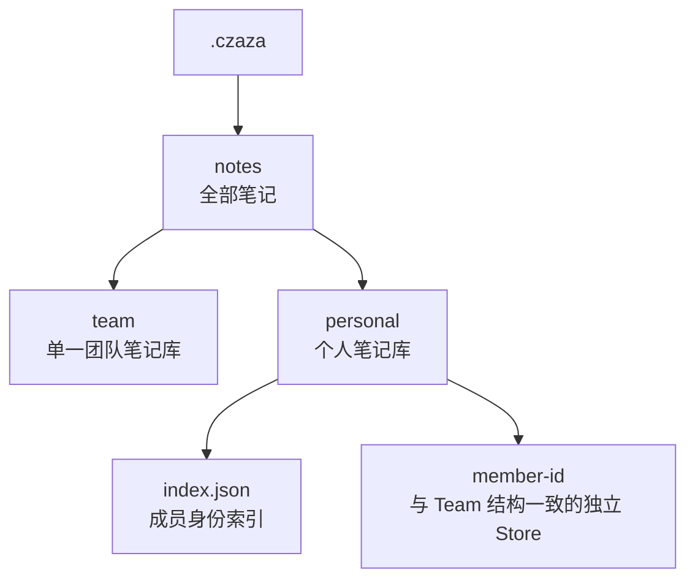
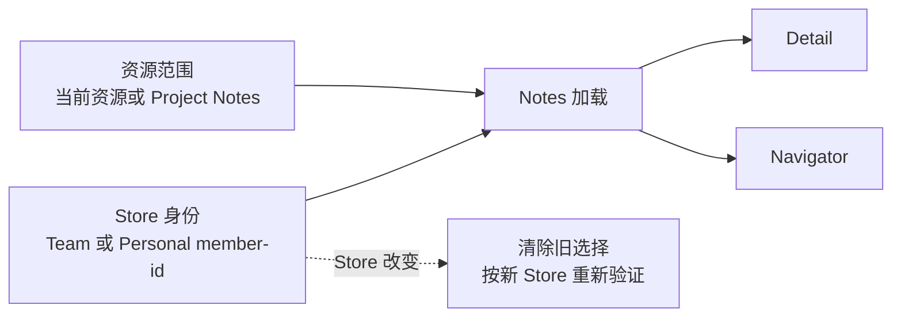

# 团队与个人笔记存储

本文说明当前 Team/Personal Notes 的存储、身份选择及 UI 读取边界。两类笔记都保存在项目中并由 Git 跟踪。

## 存储结构

```text
.czaza/
└── notes/
    ├── team/                 # 单一团队笔记库
    │   ├── index.json
    │   └── files/
    └── personal/             # 个人笔记库
        ├── index.json         # 成员身份索引
        ├── leo-8f72c1a4/
        │   ├── index.json
        │   └── files/
        └── alice-91bd40e2/
            ├── index.json
            └── files/
```



## 读取关系



## 边界

- Team 保持单一 Store：`.czaza/notes/team/`。
- Personal 按成员分 Store：`.czaza/notes/personal/<member-id>/`。
- `.czaza/notes/personal/index.json` 保存 `member-id`、展示名称和 email hash；各成员 Store 的内部结构与 Team Store 一致。
- 旧 Team Store 从 `.czaza/notes/{index.json,files/}` 由用户在各项目中手动移到 `.czaza/notes/team/`；扩展不自动移动 Git 跟踪数据。
- `member-id` 使用“标准化用户名 + 标准化 email 的 SHA-256 前 8 位”，例如 `leo-8f72c1a4`。
- Email 明文不写入仓库；email hash 用于跨设备匹配已有身份和减少重名冲突。
- Email hash 不是认证凭据，也不提供隐私保护；身份隔离只用于界面提示和防止误操作。
- “个人”表示个人维护，不表示内容私密；提交到 Git 后团队成员可以读取。
- 身份索引、Git 身份匹配、首次确认命令和本机工作区绑定已实现。
- Repository、Cache 和 CRUD 支持 Team 与 Personal Store；未指定 Store 的底层调用默认使用 Team。
- Notes 标题栏保留单一书本入口，Webview 内自定义菜单提供 Project、Team 和动态 Personal 身份子菜单。
- Personal 身份创建和切换确认使用 CZaza 自定义弹窗；身份命令的原生 Quick Pick 仍作为命令面板备用入口。
- 当前 Detail 已支持 Team/Personal 查看和手工 User Note 编辑，Personal 首次保存时初始化当前源文件记录。
- Project Notes 是资源范围，Team/Personal 是 Store 身份；切换 Project Notes 时保留当前 Store。
- Detail 与 Navigator 使用同一个具体 Store；菜单中的 Team、Personal 和具体成员选中状态互斥。
- 切换 Store 或 Personal 成员时，清除旧 Store 的 Section 选择、待编辑目标和迁移目标，再按新 Store 重新验证当前笔记。
- Personal AI 生成、迁移、Watcher 和 Runtime State 接入尚未实现。
