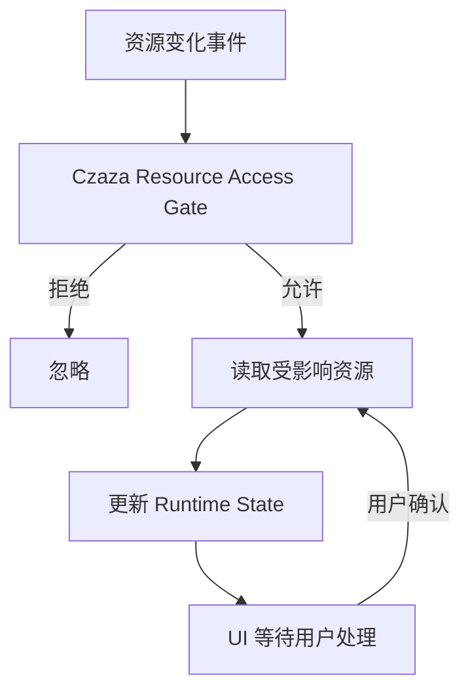

# 资源变化统一处理

本方案说明外部修改、reload、rename 和 delete 如何逐步统一为只读检测，并避免自动事件直接改写正式 Notes。

## 概览图

概览图展示所有资源变化共享的入口、分类和用户确认边界。

## 统一事件模型

归一化后的资源变化意图至少包含：

- `kind`：`contentChanged`、`renamed` 或 `deleted`。
- `resource`：受影响资源的当前路径；rename 同时包含旧路径和新路径。
- `source`：`vscodeDocument`、`watcher`、`reload` 或 `passiveCheck`。
- `observedAt`：事件被接收的时间，仅用于合并同一批通知。

事件模型不携带 Git branch、HEAD 或 revision 信息。

## 处理规则

- 相同资源在短时间内收到 VS Code 和 Watcher 重复通知时，只执行一次最新状态检查。
- 自动事件只创建或更新 Runtime State，不移动、删除或改写 Note Store 条目。
- rename 只记录 `possible rename`，避免把 Git checkout、批量重构或临时移动误判为用户确认的永久移动。
- delete 只记录 `missing`；是否保留或删除原 Notes 由用户确认。
- 用户确认前必须再次读取当前资源，防止待处理期间文件再次变化。
- 用户忽略状态时流程停止，不启动定时循环，也不修改 Note Store。

## 与当前实现的关系

当前 `registerNotesResourceEvents` 会在 Git-aware 延迟确认后直接移动或标记 Note Store 条目，Watcher 也可能把检测结果写入正式 Notes。本图描述目标架构：自动资源事件只更新 Runtime State，最终持久化只来自用户确认。
