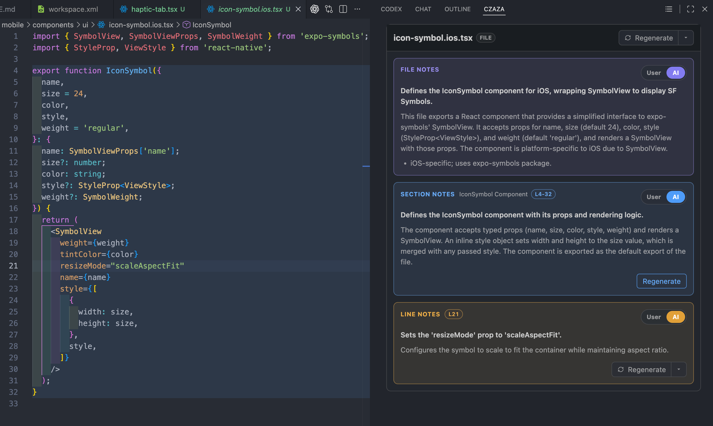

# CZaza

CZaza is a VS Code extension for understanding source code with AI.

It is focused on reading and explaining code. It does not modify source files.



## Why

When reading an unfamiliar project, developers often need to know:

- What does this file do?
- What does this section do?
- What does this line mean?

CZaza answers these questions with notes at three levels: File, Section, and Line.

## Features

- AI explanations for files, sections, and lines
- User notes for files, sections, and lines
- English or Chinese AI responses
- Notes stored inside the project
- VS Code notes panel
- Detail view for the current resource
- Navigator view for project files and notes in the current file
- Root directory configuration

## Architecture

CZaza uses three note levels:

```text
File
├── Section
└── Line
```

The main data layers are:

```text
AI models
    ↓
Domain models
    ↓
Store models
    ↓
Workspace note files
```

The AI explains the source code. The Store keeps user notes, AI notes, source
metadata, line ranges, and note status.

## AI Analysis

CZaza can analyze:

- A file and its sections
- A single section
- A single line
- A group of nearby lines
- A file, sections, and lines together

The AI returns structured JSON. CZaza then converts the result into its note
models and saves it in the workspace note store.

## Note Storage

Notes are stored under the configured CZaza output directory, usually:

```text
.czaza/
└── notes/
    ├── index.json
    └── files/
        └── <source-path-hash>-<random-id>.json
```

The index maps source paths to note files. Each source file has its own note
file, which keeps reads and updates small.

## VS Code UI

The extension provides a React-based WebView with two modes:

- **Detail**: shows notes for the selected resource
- **Navigator**: shows project File Notes and the current file's Section and Line Notes

The current file is followed when the user changes files in VS Code. Notes are
only active inside the configured CZaza root directory.

## Tech Stack

- TypeScript
- React
- Vite
- VS Code Extension API
- DeepSeek API
- Vitest

## Development

Install dependencies:

```bash
npm install
```

Run tests:

```bash
npm run test:run
```

Build the project:

```bash
npm run build
```

Build the VS Code extension:

```bash
npm run build:vscode
```

## Status

CZaza is an active prototype. The core AI analysis, note storage, note editing,
status handling, and notes UI are implemented incrementally.
