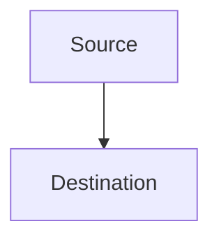

# AI Architecture Context

This directory contains project-level architecture notes that explain cross-file behavior, system structure, workflows, state transitions, ordering rules, and other durable project knowledge.

Architecture notes are independent from file, section, and line notes. Do not use them for implementation details that belong to only one specific source location.

## Reading Instructions

1. Read `README.md` when it exists to discover the available architecture documents.
2. Open only the architecture documents relevant to the current task.
3. Treat documented key rules as architectural constraints.
4. Verify architecture notes against the current implementation before changing code.
5. Do not assume that a Mermaid diagram contains every implementation detail.

## Language Rules

- All generated architecture documents and outline content MUST use the language configured by `czaza.ai.responseLanguage`.
- Headings, descriptions, Mermaid display labels, responsibilities, rules, and supporting notes MUST use the configured language.
- Mermaid syntax, source-code identifiers, API names, file paths, and other technical identifiers MUST preserve their valid syntax and original spelling.
- When no configured language is available, use the default value of `czaza.ai.responseLanguage`.

## Outline Rules

- Use `README.md` as the overall outline and navigation entry.
- Group related architecture documents under concise category headings.
- Keep every outline entry brief and consistently formatted.
- Put each logic name on its own line as a standard Markdown link to the corresponding document.
- Put one short description on the line immediately after the link.
- Use one outline entry for each distinct architectural logic.
- Keep detailed explanations and Mermaid diagrams out of the outline.
- Update the outline whenever an architecture document is added, renamed, moved, or deleted.

Example:

```md
## Notes

[Note Status Update](./diagrams/note-status-update.md)\
Describes runtime status detection and user-confirmed persistence.

[Note Detection Sources](./diagrams/note-detection-sources.md)\
Describes editor events, file-system watchers, and passive checks.
```

## Architecture Document Rules

- Store architecture documents in the `diagrams/` directory.
- Use a stable English `kebab-case` file name.
- Give each document one clear architectural responsibility.
- Include a concise title, a short purpose statement, one Mermaid diagram, and brief supporting notes.
- Keep the document focused on cross-file behavior and durable project understanding.
- Use standard relative Markdown links for related architecture documents or source files.
- Avoid copying detailed source-code explanations that belong in file, section, or line notes.

Recommended structure:

````md
# Architecture Title

A short explanation of what this architecture describes.

## Diagram



## Notes

- A brief responsibility, constraint, or behavior.
````

## Mermaid Compatibility

- Use broadly supported Mermaid syntax that works in Obsidian, GitHub, and VS Code Markdown previews.
- Use `flowchart TD` for architecture and decision flows.
- Use `sequenceDiagram` for event sequences.
- Use `stateDiagram-v2` for state transitions.
- Use ASCII identifiers for Mermaid nodes and participants.
- Use the configured response language for user-visible Mermaid labels.
- Avoid external themes, scripts, icons, HTML-dependent labels, and experimental Mermaid features.

## Maintenance Rules

- Update the relevant architecture document when a change modifies component responsibilities, data ownership, persistence, event flows, state transitions, ordering rules, or other cross-file behavior.
- Preserve links from `README.md` when moving or renaming documents.
- Prefer updating an existing architecture document over creating a duplicate explanation.
- Keep diagrams and their supporting notes consistent with each other.
